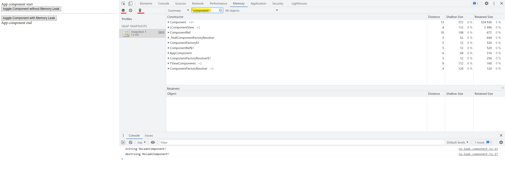
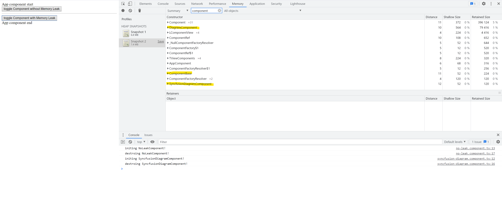

# Syncfusion Memory Leak Bug

To reproduce a Bug, first deploy the bug-project and open the Application in any Chromium based browser.

 * Click the Button **toggle Component without Memory Leak** twice
 * Go to Memory Tab in the dev tools  
 * Call garbage collector (the recycle bin Button)
 * Create a heap snapshot 
   
You will not find that the NoLeakComponent is not on the list, because it was correctly cleaned from memory.

If however you will:
 * Click the Button **toggle Component with Memory Leak** twice
 * Call garbage collector (the recycle bin Button)
 * Create a heap snapshot 

You will find that the DiagramComponent **is still in the memory** and is preventing the SynfusionDiagramComponent
to be garbage collected.

Example of a similar bug in a grid component
https://github.com/syncfusion/ej2-angular-ui-components/issues/21
